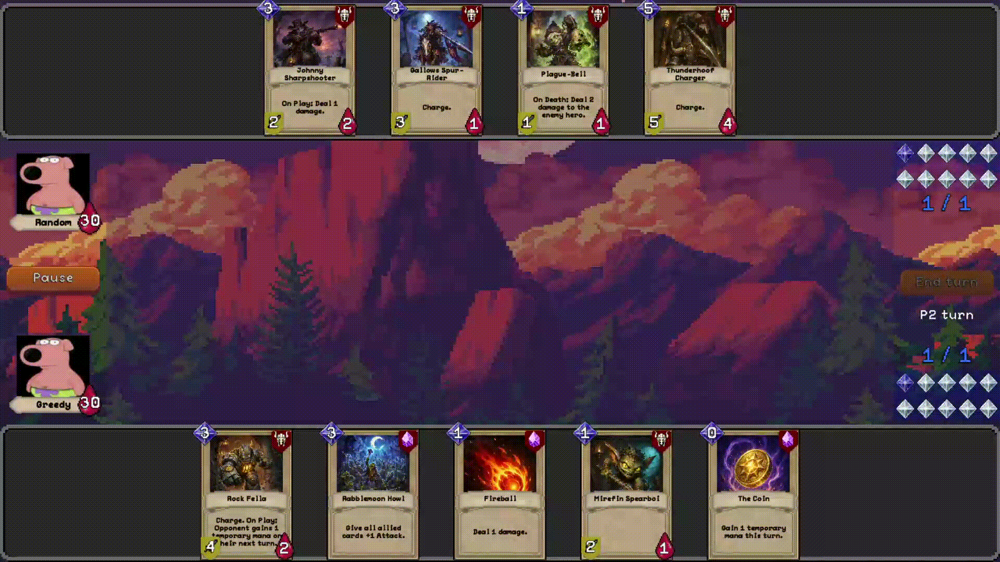
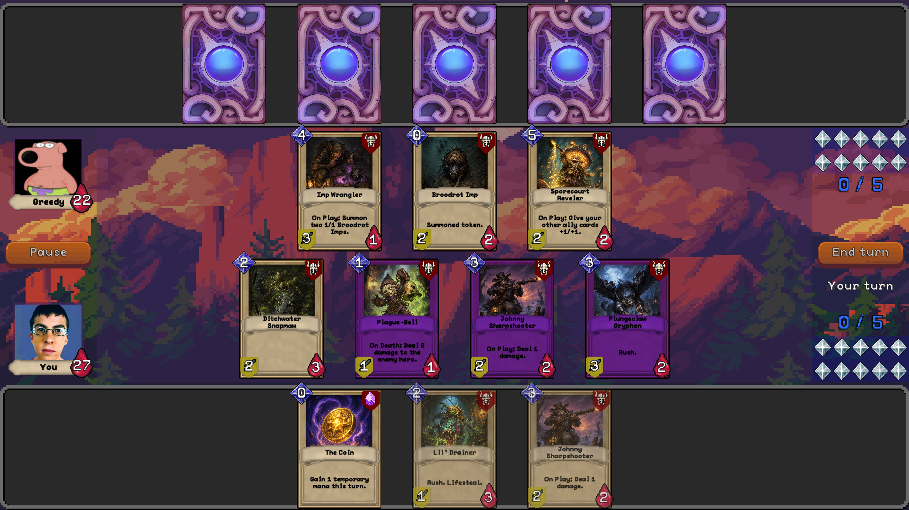
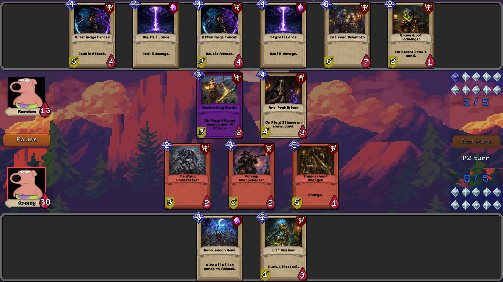
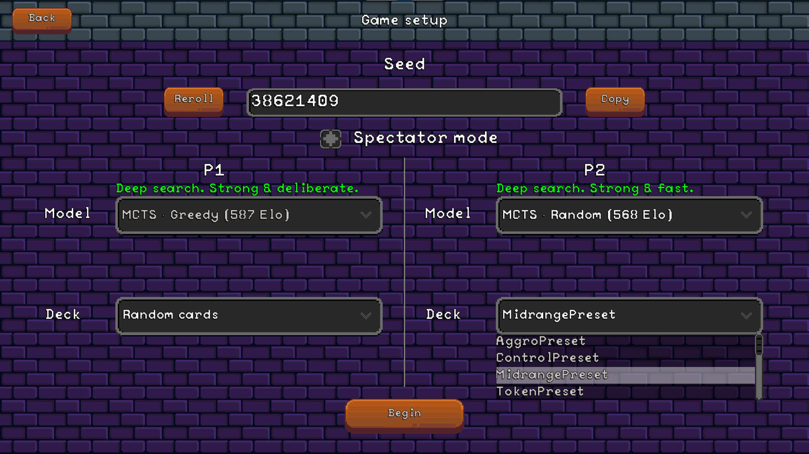
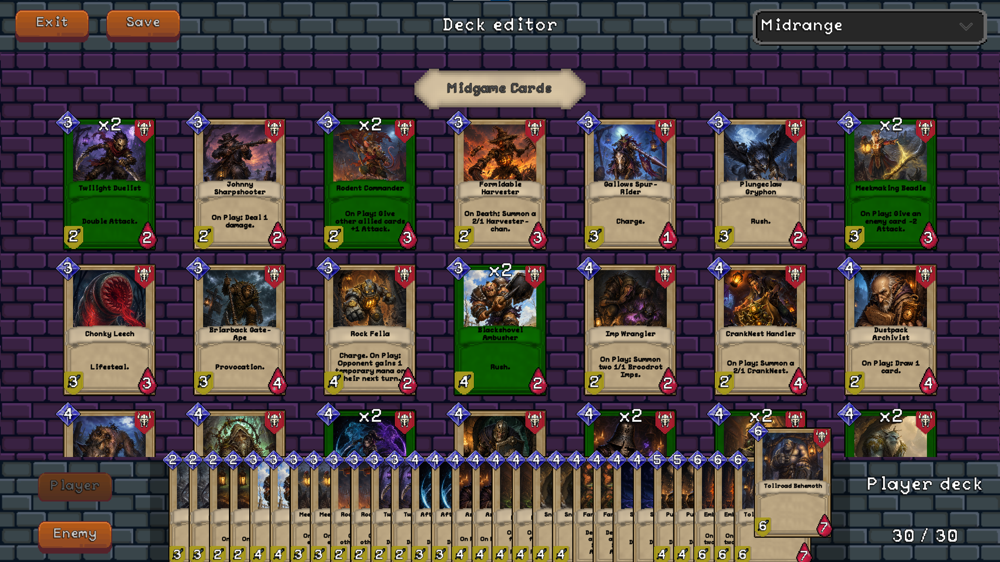
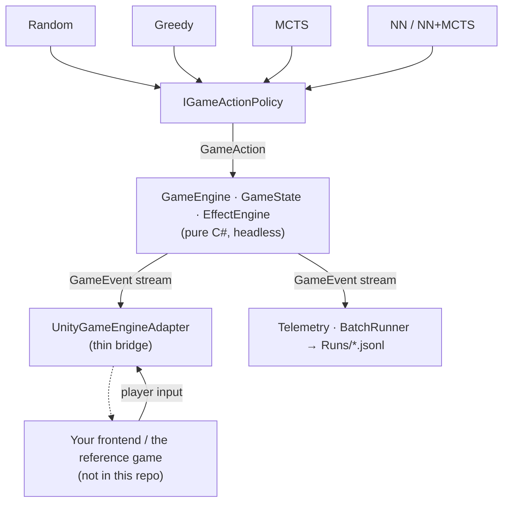

<div align="center">


### A card-game engine and AI research framework

[](https://unity.com/)

[](LICENSE)
[](https://mizantrop4real.itch.io/exec-magica)

[](https://kuzmenkoff.github.io/exec_magica_engine/)

</div>

**EXEC_MAGICA** is a turn-based collectible card game. **This repository** is its
open-source **engine, game-playing AI agents, and reproducible benchmark** for
decision-making under hidden information. The playable game built on it is on [itch.io](https://mizantrop4real.itch.io/exec-magica).

<div align="center">



<br/><sub>EXEC_MAGICA — the reference game built on this engine (AI-vs-AI spectator)</sub>

</div>

## Screenshots <!-- omit in toc -->

*EXEC_MAGICA — the reference game built on this engine:*

<table>
  <tr>
    <td width="50%"><br/>
      <sub><b>Gameplay</b> — play against an AI opponent.</sub></td>
    <td width="50%"><br/>
      <sub><b>AI-vs-AI spectator</b> — watch two agents play, both hands revealed.</sub></td>
  </tr>
  <tr>
    <td width="50%"><br/>
      <sub><b>Pre-game setup</b> — pick the opponent agent and decks.</sub></td>
    <td width="50%"><br/>
      <sub><b>Deck editor</b> — build and save custom decks.</sub></td>
  </tr>
</table>

## ▶ Play the game

This repository is the **engine + AI framework** — it does **not** contain the playable
client (the Unity visual layer and its third-party art are not included). The full game
built on this engine is on itch.io:

| Platform | Download |
|---|---|
| 🪟 Windows | [Play on itch.io](https://mizantrop4real.itch.io/exec-magica) |
| 🍎 macOS | [Play on itch.io](https://mizantrop4real.itch.io/exec-magica) |

> **macOS:** the build is unsigned. On first launch right-click the app → **Open**, or
> allow it in *System Settings → Privacy & Security*.

To use the engine itself → [Use it as a framework](#use-it-as-a-framework) ·
[Build from source](#build-from-source).

## Table of Contents <!-- omit in toc -->

- [▶ Play the game](#-play-the-game)
- [About](#about)
- [★ Key Results](#-key-results)
- [Architecture](#architecture)
- [Use it as a framework](#use-it-as-a-framework)
- [AI Models](#ai-models)
- [Build from source](#build-from-source)
- [Project structure](#project-structure)
- [Tech stack](#tech-stack)
- [Documentation](#documentation)
- [Academic context](#academic-context)
- [License](#license)

## About

**This repository** is the engine and research framework behind the card game
**EXEC_MAGICA** — a *controlled, reproducible environment* for studying how AI agents
make decisions under **hidden information** and **randomness**.

> Game rules, keywords, effects and deck presets → [RULES.md](docs/RULES.md).

Collectible card games are a hard, realistic testbed: unlike perfect-information games
such as chess or Go, a player cannot see the opponent's hand or deck (*imperfect
information*), draws and random effects introduce **stochasticity**, and the number of
possible plays each turn is large. This makes a CCG a natural domain for comparing
decision-making algorithms beyond classic search settings.

The framework pits families of agents — from simple heuristics to search-based planners —
against each other and measures them with a reproducible self-play pipeline (Elo ratings,
win-rate curves, deterministic seeds). The goal is to understand how different approaches
trade **playing strength** against **compute budget**, and to build a **learned evaluation function** 
(a distilled policy + value network) that guides the search.

### Highlights <!-- omit in toc -->
- 🧠 **Pure-C# game engine** — full CCG rules, runs and unit-tests **headless** (no Unity for logic)
- 🤖 **Pluggable AI agents** behind one interface (`IGameActionPolicy`) — swap or compare freely
- 📊 **Reproducible experiments** — headless batch self-play, Elo ladder, fixed seeds
- 🔌 **Build your own frontend** — drive the engine via a thin Unity adapter (the reference game is one such frontend)
- 🃏 **Hearthstone-style ruleset** — mana, minions, spells, triggered & on-death effects, summons, silence
- 🛠 **Data-driven cards** — define new cards in JSON with a composable effect system (damage · heal · buff · summon · silence · keywords)
- 🧬 **Self-improving agent** — AlphaZero-style loop distils MCTS self-play into a policy + value network across generations

## ★ Key Results

Agents are ranked with a reproducible self-play pipeline — round-robin over **six** decks, Wilson 95%
CIs, Bradley–Terry / Elo anchored at Random = 0, **time-matched at 1 s/move**. Full ladder & matchup
matrix → [LADDER.md](docs/LADDER.md) · generational training → [GENERATIONS.md](docs/GENERATIONS.md) ·
agent configs → [MODEL_TUNING.md](docs/MODEL_TUNING.md).

### Rating ladder (top) <!-- omit in toc -->
<sub>6 decks · 100 games/pair · fatigue-on · Elo (Random = 0) · time-matched 1 s/move</sub>

| Rank | Agent | Elo | 95% CI |
|:----:|-------|----:|:------:|
| 🥇 | MCTS + NN (gen3) | **877** | 852–903 |
| 2 | MCTS + NN (gen2) | 860 | 832–884 |
| 3 | MCTS + NN (gen1) | 856 | 828–883 |
| 4 | MCTS + NN (gen0) | 794 | 767–820 |
| 5 | MCTS · Random rollout | 741 | 718–767 |
| 6 | MCTS · Greedy rollout | 722 | 697–746 |
| 7–9 | NN (gen3) · Greedy · … | 501 · 492 · … | |
| 12 | Random (baseline) | 0 | — |

**Key findings.**
- **NN-guided search tops the field** — every NN+MCTS generation beats plain MCTS at equal time.
- **The self-improvement loop works, then plateaus** — a decisive first-generation jump (gen0→gen1,
  +62 Elo) then diminishing returns; the standalone policy network crosses the tuned-Greedy baseline at gen2.
- **A compute-scaling test locates the ceiling** — extra search still lifts play on positional decks
  (Control: 73% at 16× time) but not on fast ones (Token: flat ~50%), so the generational plateau is a
  ceiling of the **method** (representation/distillation), not of the **game**.

Full analysis → [GENERATIONS.md](docs/GENERATIONS.md).

## Architecture

A strict **logic / visual split**: a pure-C# game engine that runs headless, with a thin
Unity adapter as the only bridge to a frontend. This makes the engine **unit-testable**
and lets the same rules drive **thousands of reproducible self-play games**.



- **Logic Layer (pure C#)** — `GameEngine` / `GameState` / `EffectEngine` hold all rules
  and emit a `GameEvent` stream. No Unity dependency → runs and tests headless.
- **AI agents** plug in behind one `IGameActionPolicy` (Random / Greedy / MCTS).
- **`UnityGameEngineAdapter`** is the thin bridge a frontend drives — see
  [Use it as a framework](#use-it-as-a-framework). The visual client (the reference game)
  is **not** in this repo.
- **Telemetry** drives headless self-play via `BatchRunner` → `Runs/*.jsonl`
  (see [DATA_FORMAT.md](docs/DATA_FORMAT.md)).

## Use it as a framework

The engine is frontend-agnostic. To build your **own** card game on it, drive the
`UnityGameEngineAdapter` and render the `GameEvent` stream however you like:

```csharp
var adapter = new UnityGameEngineAdapter();
adapter.Initialize(initialState);                      // a GameState (cards + decks)

while (!adapter.State.IsGameOver)
{
    var side   = adapter.State.ActiveSide;
    var legal  = adapter.GetLegalActions(side);
    var action = policy.ChooseAction(adapter.State, legal, side); // AI, or your player input
    var result = adapter.ApplyAction(action);          // result.Events → render your view
}
```

- Plug in any AI via **`IGameActionPolicy`** — Random / Greedy / MCTS are included.
- The reference game (on itch.io) is one frontend built exactly this way.
- Full guide → [FRAMEWORK.md](docs/FRAMEWORK.md).

## AI Models

Each agent plugs into the engine behind a single `IGameActionPolicy`. Full algorithm descriptions and parameters → [AGENTS.md](docs/AGENTS.md). 
How they are tuned and frozen → [MODEL_TUNING.md](docs/MODEL_TUNING.md); full rankings → [LADDER.md](docs/LADDER.md).

| Agent | Approach |
|---|---|
| **Random** | Uniform-random legal moves — the baseline floor. |
| **Greedy** | One-ply heuristic: picks the move maximizing a tuned board-evaluation. |
| **MCTS · Random rollout** | ISMCTS with random playouts — cheap, many simulations. |
| **MCTS · Greedy rollout** | ISMCTS with greedy playouts — high per-rollout quality. |
| **NN** | A distilled policy + value network — plays **without search**. |
| **MCTS + NN** | ISMCTS **guided by the network** (policy prior + value at the leaf) — AlphaZero-style. |

> The **NN** and **MCTS + NN** agents evolve by generation (gen0–gen3), each trained by self-play under
> the previous generation's champion — see [GENERATIONS.md](docs/GENERATIONS.md) and
> [`ml/train_generations.ipynb`](ml/train_generations.ipynb).
> All MCTS agents are **ISMCTS** (information-set MCTS): each iteration they re-deal the
> opponent's unplayed cards into a plausible hand/deck split (determinization) and search
> over the resulting information set. The decklist is assumed known — the same card counting
> a human could do — but **which cards are currently in hand is hidden**.

## Build from source

Requires **Unity 2021.3.32f1**. The optional headless runner (`bench/`) needs the **.NET 8 SDK**.

1. Clone the repo and open it via **Unity Hub** (it offers to install 2021.3.32f1).
2. The engine + experiment tooling compile **out of the box** — no extra assets needed.
3. Run experiments from the **EXEC_MAGICA** menu — **Ladder…**, **Run Batch…** and **Self-Play Data…**.
   Each window offers two buttons: **Run (Unity)** for an in-editor run, and **Run (.NET)** to launch the
   standalone headless runner — parallel, all-cores, and non-blocking (Unity stays responsive).
4. Run the headless unit tests: **Window → General → Test Runner → EditMode**.

To build a playable client on top of the engine → [Use it as a framework](#use-it-as-a-framework).
The reference game is on [itch.io](https://mizantrop4real.itch.io/exec-magica).

Prefer a ready binary? Download it from [itch.io](https://mizantrop4real.itch.io/exec-magica) — no Unity needed.

## Project structure

```
Assets/
├── _Project/
│  ├── Scripts/
│  │  ├── Gameplay/LogicLayer/     # pure-C# engine — Engine · State · Rules · Effects · Cards ·
│  │  │                            #   Events · Decks · Telemetry · AI (agents + StateEncoder + NeuralNet)
│  │  ├── UnityBridge/             # UnityGameEngineAdapter — the frontend hook
│  │  └── Editor/                  # research tooling — Batch / Ladder / Self-Play windows,
│  │     └── Ladder/               #   Elo rating; BenchLauncher launches the .NET runner
│  └── Tests/                      # EditMode unit tests (90, headless logic)
└── Resources/
   ├── CardsInfo/                  # card data + deck presets (JSON)
   ├── CardsLogos/                 # AI-generated card art (PNG)
   ├── Models/                     # distilled networks — InGame/ (shipped) · Experimental/ (research)
   └── OpponentModels/             # AI model configs (.asset)
bench/                             # standalone .NET headless runner — generate · batch · ladder · duel · ceiling
ml/                                # training — train.py · train_generations.ipynb (self-play distillation)
docs/                              # RULES · AGENTS · GENERATIONS · MODEL_TUNING · LADDER · METRICS · DATA_FORMAT · FRAMEWORK · TESTING
ProjectSettings/                   # Unity project config
Packages/                          # Unity package manifest + lock
```

The **logic / visual split** maps directly to `Gameplay/LogicLayer` (pure C#, headless, unit-tested)
vs `Gameplay/VisualLayer` (Unity, no rules — not in this repo). The AI agents live in `LogicLayer/AI`;
Unity experiment tooling in `Scripts/Editor`; the standalone parallel runner in `bench/`; and the
self-play training pipeline in `ml/`.

## Tech stack

| Area | Tech |
|---|---|
| Engine / language | Unity 2021.3.32f1 (LTS) · C# |
| Serialization | Newtonsoft.Json (card data, telemetry) |
| Testing | Unity Test Framework (EditMode — headless logic) |
| Data / telemetry | JSON · JSON Lines (`Runs/`) |
| Analysis / ML | Python · PyTorch (self-play distillation) · matplotlib |
| AI | Information-Set MCTS · heuristic & random agents · distilled policy+value network (NN, NN+MCTS) |
| Parallel experiments | standalone **.NET** headless runner (server GC) — same engine, ~10× throughput |

## Documentation

📖 **[Live API reference](https://kuzmenkoff.github.io/exec_magica_engine/)** — auto-generated from the engine's XML docs (DocFX).

| Document | Contents |
|---|---|
| [RULES.md](docs/RULES.md) | Game rules, keywords, effects, deck presets |
| [AGENTS.md](docs/AGENTS.md) | How each AI agent works and its parameters |
| [MODEL_TUNING.md](docs/MODEL_TUNING.md) | How agent parameters were tuned and frozen |
| [LADDER.md](docs/LADDER.md) | Rating ladder — Elo and matchup matrix |
| [METRICS.md](docs/METRICS.md) | Metric definitions and formulas |
| [DATA_FORMAT.md](docs/DATA_FORMAT.md) | Serialized game/session schema for analysis & ML |
| [GENERATIONS.md](docs/GENERATIONS.md) | Per-generation NN training, strength & the ceiling analysis |
| [FRAMEWORK.md](docs/FRAMEWORK.md) | How to build on the engine + the .NET experiment runner |
| [TESTING.md](docs/TESTING.md) | The headless unit-test suite (90 tests) |
| [`ml/train_generations.ipynb`](ml/train_generations.ipynb) | Reproducible generational training pipeline |

## Academic context

EXEC_MAGICA is the software artifact of a **Master's thesis** at the National Technical
University of Ukraine "Igor Sikorsky Kyiv Polytechnic Institute" (NTUU "KPI"), 2026.

> *Methods and software tools for decision-making by game agents in collectible card
> games using artificial neural networks*

It studies how decision-making approaches — from simple heuristics to search-based
planning, and toward a learned value function — cope with the **hidden information** and
**stochasticity** of a collectible card game. The game doubles as a reproducible benchmark;
quantitative results are in [MODEL_TUNING.md](docs/MODEL_TUNING.md) and [LADDER.md](docs/LADDER.md).

If you use this work, please cite it — see [CITATION.cff](CITATION.cff).

## License

Released under the **MIT License** — see [LICENSE](LICENSE). This covers the engine, the
AI agents, and the bundled (AI-generated) card art.

The playable reference game uses additional third-party assets (art, audio, fonts) that are
**not part of this repository**; they remain under their own licenses and are credited on the
game's [itch.io page](https://mizantrop4real.itch.io/exec-magica).