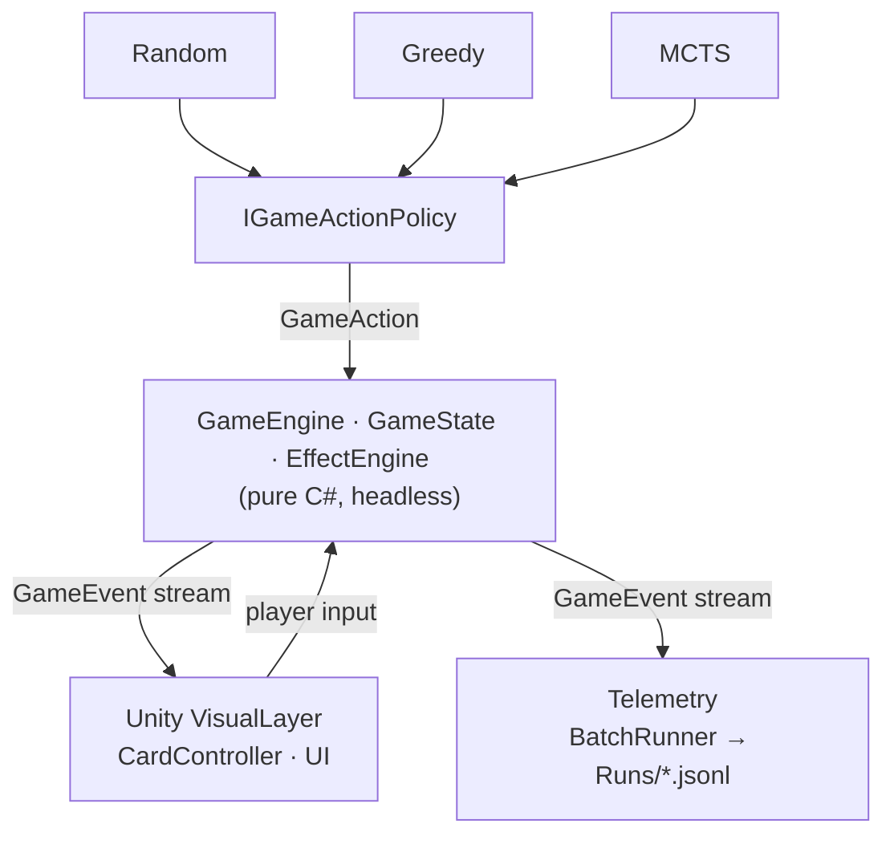

<div align="center">


### A collectible card game built as a benchmark for game-playing AI

[](https://unity.com/)

[](LICENSE)
[](https://mizantrop4real.itch.io/exec-magica)


</div>

**EXEC_MAGICA** is a turn-based collectible card game you can play yourself — or watch AI agents compete against each other to study decision-making under hidden information.

<div align="center">


</div>

## ▶ Play

Download a ready-to-play build — no Unity required:

| Platform | Download |
|---|---|
| 🪟 Windows | [Download on itch.io](https://mizantrop4real.itch.io/exec-magica) |
| 🍎 macOS | [Download on itch.io](https://mizantrop4real.itch.io/exec-magica) |

> **macOS:** the build is unsigned. On first launch right-click the app → **Open**,
> or allow it in *System Settings → Privacy & Security*.

Prefer to build it yourself? See [Build from source](#build-from-source).

## Table of Contents <!-- omit in toc -->

- [▶ Play](#-play)
- [About](#about)
- [★ Key Results](#-key-results)
- [Screenshots](#screenshots)
- [Architecture](#architecture)
- [AI Models](#ai-models)
- [Build from source](#build-from-source)
- [Project structure](#project-structure)
- [Tech stack](#tech-stack)
- [Documentation](#documentation)
- [Academic context](#academic-context)
- [Acknowledgments](#acknowledgments)
- [License](#license)

## About

**EXEC_MAGICA** is a collectible card game built as a *controlled,
reproducible environment* for studying how AI agents make decisions under
**hidden information** and **randomness**. 

> Game rules, keywords, effects and deck presets → [RULES.md](docs/RULES.md).

Collectible card games are a hard, realistic testbed: unlike perfect-information
games such as chess or Go, a player cannot see the opponent's hand or deck
(*imperfect information*), draws and random effects introduce **stochasticity**,
and the number of possible plays each turn is large. This makes a CCG a natural
domain for comparing decision-making algorithms beyond classic search settings.

The project pits families of agents — from simple heuristics to search-based
planners — against each other and measures them with a reproducible self-play
pipeline (Elo ratings, win-rate curves, deterministic seeds). The goal is to
understand how different approaches trade **playing strength** against
**compute budget**, and to motivate a learned evaluation function as the next step.

### Highlights <!-- omit in toc -->
- 🤖 **Pluggable AI agents** behind a single interface — swap or compare them freely
- 📊 **Reproducible experiments** — headless batch self-play, Elo ladder, fixed seeds
- 👁 **AI-vs-AI spectator** + human-vs-AI play
- 🃏 **Hearthstone-style ruleset** — mana, minions, spells, triggered & on-death effects, summons, silence
- 🧱 **Clean Logic/Visual split** — a pure C# engine that runs and tests headless

## ★ Key Results

Agents are ranked with a reproducible self-play pipeline — round-robin over four decks,
Wilson 95% CIs, Bradley–Terry / Elo anchored at Random = 0, under a **≤ 2 s/move**
eligibility cap. Full ladder & matchup matrix → [LADDER.md](docs/LADDER.md) · agent
configs → [MODEL_TUNING.md](docs/MODEL_TUNING.md) · how the agents work →
[AGENTS.md](docs/AGENTS.md) · metric definitions → [METRICS.md](docs/METRICS.md).

### Rating ladder <!-- omit in toc -->
<sub>4 decks · 160 games/pair · fatigue-on · Elo (Random = 0) · bootstrap 95% CI</sub>

| Rank | Agent | Elo | 95% CI | Win % | Think/move |
|:----:|-------|----:|:------:|------:|:----------:|
| 🥇 | MCTS · Greedy rollout | **587** | 501–685 | 72.5 | 1.5 s |
| 🥈 | MCTS · Random rollout | 568 | 492–657 | 69.8 | 0.58 s |
| 🥉 | Greedy (tuned) | 455 | 377–532 | 53.1 | <1 ms |
| 4 | Random (baseline) | 0 | — | 4.6 | <1 ms |

> **Tiers:** {MCTS Greedy ≈ MCTS Random} ≫ Greedy ≫ Random

**Key finding.** The two MCTS agents are **statistically tied** at the top (overlapping CIs,
53–47 head-to-head) — yet the random-rollout agent reaches that strength at **~⅓ the
think-time** (0.58 s vs 1.5 s). Under a compute budget, cheap-and-plentiful *random*
rollouts are as effective as expensive *greedy* ones — the result that motivates a learned
value function as the next step. Full analysis →
[MODEL_TUNING.md](docs/MODEL_TUNING.md#comparison--rollout-policies-strength-vs-time).

## Screenshots

<table>
  <tr>
    <td width="50%"><br/>
      <sub><b>Gameplay</b> — play against an AI opponent.</sub></td>
    <td width="50%"><br/>
      <sub><b>AI-vs-AI spectator</b> — watch two agents play against each other with both hands revealed.</sub></td>
  </tr>
  <tr>
    <td width="50%"><br/>
      <sub><b>Pre-game setup</b> — pick the opponent agent and decks.</sub></td>
    <td width="50%"><br/>
      <sub><b>Deck editor</b> — build and save custom decks.</sub></td>
  </tr>
</table>

## Architecture

A strict **logic / visual split**: a pure-C# game engine that runs headless, with
Unity only as a view. This is what makes the engine **unit-testable** and lets the
same rules drive **thousands of reproducible self-play games** for the experiments.



- **Logic Layer (pure C#)** — `GameEngine` / `GameState` / `EffectEngine` hold all rules
  and emit a `GameEvent` stream. No Unity dependency → runs and tests headless.
- **AI agents** plug in behind a single `IGameActionPolicy`, so Random / Greedy / MCTS
  are swapped or pitted against each other without touching the engine.
- **Visual Layer (Unity)** renders the event stream and forwards player input — it never
  implements rules (the engine is the source of truth).
- **Telemetry** drives headless self-play via `BatchRunner` and serializes games to
  `Runs/` for analysis and ML — see [DATA_FORMAT.md](docs/DATA_FORMAT.md).

## AI Models

Each agent plugs into the engine behind a single `IGameActionPolicy`. Full algorithm descriptions and parameters → [AGENTS.md](docs/AGENTS.md). 
How they are tuned and frozen → [MODEL_TUNING.md](docs/MODEL_TUNING.md); full rankings → [LADDER.md](docs/LADDER.md).

| Agent | Approach |
|---|---|
| **Random** | Uniform-random legal moves — the baseline floor. |
| **Greedy** | One-ply heuristic: picks the move maximizing a tuned board-evaluation. |
| **MCTS · Greedy rollout** | ISMCTS with **greedy** playouts — high per-rollout quality. |
| **MCTS · Random rollout** | ISMCTS with **random** playouts — far cheaper, many more simulations. |
| **MCTS · ML rollout** 🚧 | _Planned_ — a learned value function replaces playouts. |

> All MCTS agents are **ISMCTS** (information-set MCTS): each iteration they re-deal the
> opponent's unplayed cards into a plausible hand/deck split (determinization) and search
> over the resulting information set. The decklist is assumed known — the same card counting
> a human could do — but **which cards are currently in hand is hidden**.

## Build from source

Requires **Unity 2021.3.32f1** (the version the project is pinned to).

1. Clone the repo and open the folder via **Unity Hub** (it will offer to install
   2021.3.32f1 if you don't have it).
2. Open `Assets/_Project/Scenes/MainMenu_Scene.unity` and press **Play**, or
3. Build a standalone: **File → Build Settings → Windows / macOS → Build**.

Prefer a ready binary? Download it from [itch.io](https://your-itch-url) — no Unity needed.

## Project structure

```
Assets/
├── _Project/                       # all first-party work
│   ├── Scripts/
│   │   ├── Gameplay/LogicLayer/     # pure-C# engine — Engine, State, Rules, Effects,
│   │   │   └── AI/                  #   Events, Telemetry + the agents (Random/Greedy/MCTS)
│   │   ├── Gameplay/VisualLayer/    # Unity view — UI, Views, Managers, Input (no game rules)
│   │   ├── Editor/                  # tuning & experiment tools (sweeps, rating ladder)
│   │   └── MainMenu/  DeckEditor/  Settings/  Audio/
│   ├── Scenes/                      # MainMenu · Gameplay · DeckEditor
│   ├── Tests/                       # EditMode unit tests (headless logic)
│   └── Art/  Audio/  Prefabs/
├── Resources/                       # card data (CardsInfo/), AI presets (OpponentModels/)
└── ThirdParty/                      # licensed third-party assets (see Acknowledgments)
ProjectSettings/                     # Unity project config (committed)
Packages/                            # Unity package manifest + lock (committed)

Documentation/                       # METRICS · DATA_FORMAT · MODEL_TUNING · AGENTS · ROADMAP
Runs/                                # experiment telemetry — JSONL, git-ignored
```

The **logic / visual split** maps directly to `Gameplay/LogicLayer` (pure C#, headless,
unit-tested) vs `Gameplay/VisualLayer` (Unity, no rules). The AI agents live in
`LogicLayer/AI`; all experiment tooling in `Scripts/Editor`.

## Tech stack

| Area | Tech |
|---|---|
| Engine | Unity 2021.3.32f1 (LTS) |
| Language | C# |
| UI / text | TextMeshPro |
| Animation | DOTween |
| Testing | Unity Test Framework (EditMode — headless logic) |
| Data / telemetry | JSON · JSON Lines (`Runs/`) |
| Analysis | Python (matplotlib) for result plots |
| AI | Information-Set MCTS · heuristic & random agents |
| Planned (ML) | learned value/policy network — framework TBD |

## Documentation

| Document | Contents |
|---|---|
| [RULES.md](docs/RULES.md) | Game rules, keywords, effects, deck presets |
| [AGENTS.md](docs/AGENTS.md) | How each AI agent works and its parameters |
| [MODEL_TUNING.md](docs/MODEL_TUNING.md) | How agent parameters were tuned and frozen |
| [LADDER.md](docs/LADDER.md) | Rating ladder — Elo and matchup matrix |
| [METRICS.md](docs/METRICS.md) | Metric definitions and formulas |
| [DATA_FORMAT.md](docs/DATA_FORMAT.md) | Serialized game/session schema for analysis & ML |

## Academic context

EXEC_MAGICA is the software artifact of a **Master's thesis** at the National Technical
University of Ukraine "Igor Sikorsky Kyiv Polytechnic Institute" (NTUU "KPI"), 2026.

> *Methods and software tools for decision-making by game agents in collectible card
> games using artificial neural networks*

It studies how decision-making approaches — from simple heuristics to search-based
planning, and toward a learned value function — cope with the **hidden information** and
**stochasticity** of a collectible card game. The game doubles as a reproducible benchmark;
quantitative results are in [MODEL_TUNING.md](docs/MODEL_TUNING.md) and [LADDER.md](docs/LADDER.md).

If you use this work, please cite it — see [CITATION.cff](CITATION.cff).

## Acknowledgments

Built with these third-party works — thanks to their authors. Each retains its own license.

## License

Code is released under the **MIT License** — see [LICENSE](LICENSE).

Third-party assets under `Assets/ThirdParty/` (art, audio, fonts) retain their **own
licenses** and are **not** covered by MIT — see [Acknowledgments](#acknowledgments).