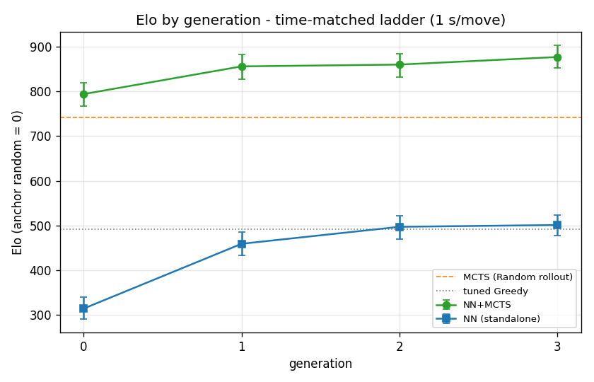
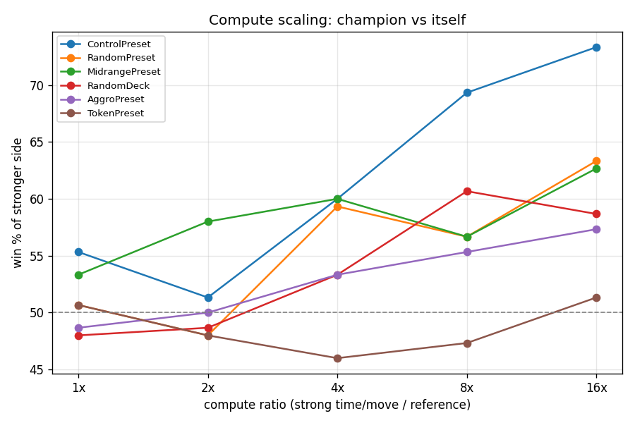

# EXEC_MAGICA — learned-agent evolution <!-- omit in toc -->

Per-generation record of the distilled network: **what changed** (encoding, teacher,
training) and **how strong** it got. Classic-agent tuning → [MODEL_TUNING.md](MODEL_TUNING.md);
rankings → [LADDER.md](LADDER.md); data format → [DATA_FORMAT.md](DATA_FORMAT.md). The per-generation **training** is reproduced by
[`ml/train_generations.ipynb`](../ml/train_generations.ipynb).

## Contents <!-- omit in toc -->
- [What a generation is](#what-a-generation-is)
- [Metrics tracked per generation](#metrics-tracked-per-generation)
- [gen0 — champion (encoding v2, compact)](#gen0--champion-encoding-v2-compact)
- [gen1 — self-improvement (encoding v2, teacher = gen0 champion)](#gen1--self-improvement-encoding-v2-teacher--gen0-champion)
- [gen2 — encoding v3 (unseen-card pools), teacher = gen1 champion](#gen2--encoding-v3-unseen-card-pools-teacher--gen1-champion)
- [gen3 — pool-aware teacher (encoding v3), teacher = gen2-v3](#gen3--pool-aware-teacher-encoding-v3-teacher--gen2-v3)
- [Conclusion — the generational arc and the game's ceiling](#conclusion--the-generational-arc-and-the-games-ceiling)

## What a generation is
One (encoding + teacher + training) iteration producing a network and its two agents —
**NN** (standalone) and **NN+MCTS** (PUCT + value-at-leaf). Generations differ structurally
(encoding/architecture) and in strength. Intended loop: gen *N*'s NN+MCTS generates gen
*N+1*'s self-play data (AlphaZero-style).

## Metrics tracked per generation
- **Dataset** — games, samples, teacher config, layout version, card-set revision.
- **Value** — validation MSE; **win-prediction accuracy** (sign of value vs actual winner).
- **Policy** — target entropy **H(π)** (the achievable floor), residual **KL** = loss − H(π),
  top-1 accuracy (and excluding forced 1-move states).
- **Strength** — ladder **Elo** (anchor `random` = 0) for NN and NN+MCTS; key head-to-heads.

---

## gen0 — champion (encoding v2, compact)

**Setup.** Encoding **v2** (`v2-1216`: structured card effects + slot CardIds). Teacher: ISMCTS
2000 iters, Random rollout, decks 60/40 preset/random, fatigue-on. **~3k games → ~276k samples.**
Net: MLP **1216→128→128** → policy(227)+value(tanh); hand-written C# forward (sparse + legal-only).
Agent **NN+MCTS**: PUCT prior + leaf **value+rollout mix = 0.75**, maxRolloutActions=40.

**Training.**

| metric | value |
|---|---|
| value validation MSE | ~0.38 |
| value win-prediction accuracy | **0.848** (decisive; chance 0.50) |
| policy floor H(π) | 1.381 |
| policy residual KL | ~0.044 |

**Strength.**

| matchup / metric | result |
|---|---|
| NN+MCTS vs MCTS, equal time (RandomDeck) | **57–60%** — significant win |
| NN+MCTS vs MCTS, equal time (Aggro) | ~51% — tie (fast tactical races) |
| NN+MCTS vs tuned Greedy (~1 s/move) | ~92% |
| sample efficiency | ~2× fewer iterations than Random rollout |
| **Elo — NN+MCTS** (ladder, 1 s/move) | **794** [767–820] |
| **Elo — NN** (standalone) | **314** [291–339] |

**Findings.**
- **First equal-time win over MCTS** — the value+rollout mix (D-log) fixes leaf distribution-shift;
  the compact net + sparse/legal-only forward closed the speed gap (6×→~1.6× vs plain MCTS).
- **NN guidance ≈ 2× iteration-efficient** — reaches the win-rate ceiling with half the simulations.
- **Aggro remains a tie** — aggressive mirror races are decided by raw search depth, where positional
  understanding helps least; the NN edge shows on varied/positional matchups.

---

## gen1 — self-improvement (encoding v2, teacher = gen0 champion)

**Setup.** Encoding **v2** (unchanged). Teacher: **gen0's NN+MCTS champion** (PUCT + mix 0.75,
Random rollout, 5000 iters), decks 60/40 preset/random. **~9k games → 736k samples** (×2.7 vs gen0).
Net: same **1216→128→128**. Only two things changed vs gen0: the **teacher** (gen0 champion, not plain
MCTS) and **visit-target softening** at **temp = 1.3**. Everything else held constant — so the gain is
attributable, not confounded.

**Training.**

| metric | gen1 | gen0 | note |
|---|---|---|---|
| samples | 736 136 | 276 616 | ×2.7 data |
| policy floor H(π) @ temp 1.3 | **0.989** | 1.381 | teacher far sharper → real signal to learn |
| policy residual KL | 0.181 | 0.044 | higher: targets carry information, net works to fit them |
| value win-prediction accuracy | 0.800 | 0.849 | *lower — see below* |
| value validation MSE | 0.542 | 0.384 | *higher — see below* |

The value metrics look **worse**, and that is expected: the champion's self-play games are more
**balanced**, so their outcome is genuinely **harder to predict** from a mid-game position. Value is
only 25% of the leaf estimate (mix 0.75), so this does not hurt strength — and strength rose sharply.

**The temperature is the key knob (inverted-U).** Distilling the champion's near-deterministic visit
counts verbatim (temp 1.0) gives a target so sharp the net cannot fit it (KL 0.269) → a "sharp but wrong"
prior that ties. Over-softening (the initial temp 2.0 attempt, on less data) washes the signal out → also
a tie. **temp 1.3 is the optimum:** sharp enough to carry signal, soft enough to learn.

| temp | floor H(π) | KL | duel vs gen0 |
|---|---|---|---|
| 1.0 | 0.847 | 0.269 | ~52% — tie (sharp but unfittable) |
| **1.3** | **0.989** | **0.181** | **57% Random / 55% Aggro — WIN (frozen champion)** |
| 1.5 | 1.054 | 0.141 | tie |
| 2.0 | 1.148 | 0.081 | ~51% — tie (signal washed out) |

**Strength.**

| matchup / metric | result |
|---|---|
| gen1 vs gen0, duel @5000 iters (800 games) | **58.3%** [54.8–61.6] — significant |
| gen1 vs gen0 by deck | Control 67% · RandomDeck 57% · Aggro 55% · RandomPreset 54% |
| **Elo — NN+MCTS** (ladder, 1 s/move) | **856** [828–883]  (+62 vs gen0) |
| **Elo — NN** (standalone) | **459** [433–486]  (+145 vs gen0) |

**Findings.**
- **The self-improvement loop works.** One generation of self-play under the gen0 champion produced a
  measurably stronger network — at **both** levels: NN+MCTS +74 Elo, and the raw policy network +143 Elo.
- **The policy head improved most.** The standalone net jumped nearly twice as far as the ensemble, and
  crossed the **Greedy baseline**: gen0's net sat *below* Greedy (313 < 494), gen1's net reaches it
  (456 ≈ 494) and wins the head-to-head 53–47. Self-play turned the prior from "worse than a heuristic"
  into "better than a heuristic."
- **The gain is positional.** Both gen0-vs-MCTS and gen1-vs-gen0 peak on **ControlPreset** (67%), the
  long, positional matchup — and are weakest on Aggro (55%), where short tactical races reward raw search
  depth over understanding. The network systematically accumulates *positional* skill across generations,
  not tactical speed. This points at Aggro as the next lever, and motivates encoding **v3** (unseen-card
  pools) to close the last information gap with the teacher.

  ---

## gen2 — encoding v3 (unseen-card pools), teacher = gen1 champion

**Setup.** Teacher: **gen1's NN+MCTS champion** (mix 0.75, Random rollout, 5000 iters), temp = 1.3,
decks 60/40 preset/random. **~9k games → 709k samples.** Data generated with **encoding v3** (`v3-1616`):
the v2 vector (1216) plus two **unseen-card-pool** blocks (opponent + own remaining cards, summed by
mana bucket — permutation-invariant, deck order never encoded). Because v3 **appends** to v2, the v2
layout is a strict **prefix** of v3, so a single dataset trains **both** nets by slicing the feature
vector — a clean ablation with the teacher and data held identical.

**Training (one dataset, two nets).**

| metric | gen2-v2 (1216) | gen2-v3 (1616) | Δ (v3 − v2) |
|---|---|---|---|
| policy residual KL | 0.130 | 0.131 | **+0.002 (flat)** |
| value win-prediction accuracy | 0.787 | **0.821** | **+0.034** |
| value validation MSE | 0.583 | **0.502** | **−0.081 (−14%)** |

The encoding's gain is entirely in the **value head**; the **policy head does not move** (KL flat).
Intuition: knowing the opponent's unseen pool sharpens *position evaluation* (value), but rarely changes
*which* move the teacher visited most (policy). Note the value accuracy also **stops declining**
(gen0 0.849 → gen1 0.800 → gen2-v2 0.787 → gen2-v3 **0.821**): richer features offset the fact that each
champion's self-play games get more balanced and harder to predict.

**Strength.** Two duels isolate the two levers (equal iterations = 5000):

| matchup / metric | result |
|---|---|
| gen2-v2 vs gen1 (loop, same encoding) | ~50.6% — **tie** (v2 plateau) |
| gen2-v3 vs gen2-v2 (encoding, same data) | **54.6%** [51.2–58.1] — significant |
| gen2-v3 vs gen2-v2 by deck | Control 61% · RandomPreset 55.5% · RandomDeck 51.5% · Aggro 50.5% |
| gen2-v3 vs gen2-v2, time-matched (1 s/move) | 49.6% — tie (per-iter edge offset by slower forward) |
| **Elo — NN+MCTS** (ladder, 1 s/move) | **860** [832–884]  (+4 vs gen1) |
| **Elo — NN** (standalone) | **497** [470–521]  (crosses Greedy 492) |

**Findings.**
- **The loop hit a representation ceiling; a richer encoding lifted it.** Under v2 the champion had
  nothing more to teach (gen2-v2 = gen1); v3's unseen-pool features extracted a fresh, **value-side** gain,
  concentrated on the positional **Control** deck (61%).
- **Per-iteration vs per-second.** v3's dense pool block makes the forward ~15–20% slower, so at **equal
  time** v3 ≈ v2 — the quality gain and the speed cost cancel. v3 is not a faster *player*, but it **is** a
  better *per-decision* agent → a better **teacher** (offline self-play uses a fixed iteration budget, where
  the per-iteration edge is what counts). **gen2-v3 becomes the champion.**
- The policy prior did **not** improve here because the teacher (gen1) was itself pool-blind — its visit
  targets carried no pool signal. That sets up gen3.

  ---

## gen3 — pool-aware teacher (encoding v3), teacher = gen2-v3

**Setup.** Teacher: **gen2-v3** — the *first pool-aware champion* (its NN+MCTS conditions on the unseen
pools). **~9k games → 700k samples**, encoding v3. Hypothesis: a pool-aware teacher's visit distributions
now carry pool signal, so gen3's **policy** head could finally pick up hidden-information play that gen2's
could not (gen2 learned from the pool-blind gen1). **Temperature was swept**, not fixed — the optimal
distillation temperature depends on teacher sharpness, and the teacher changed.

**Training (temp sweep).**

| temp | floor H(π) | KL | value win-acc |
|---|---|---|---|
| 1.0 | 0.821 | 0.195 | 0.820 |
| 1.3 | 0.943 | 0.134 | 0.821 |
| **1.5** | **1.000** | 0.106 | 0.818 |

The teacher is **sharper** than gen1's (floor at temp 1.3 fell 0.989 → 0.943), so the optimum shifted
**up**: **temp 1.5** lands at floor ≈ 1.0, the same sweet-spot that won for gen1. Value accuracy holds
at ~0.82 — the v3 encoding keeps evaluation from degrading as games get more balanced.

**Strength.** Champion selected by duel vs gen2-v3 (both v3 → equal time ≡ equal iterations):

| matchup / metric | result |
|---|---|
| gen3 (t1.5) vs gen2-v3, pooled 800 games | **53.8%** — marginal |
| gen3 (t1.5) by deck | RandomPreset 56.5% · Aggro 54.5% · RandomDeck 54% · Control 50% |
| gen3 (t1.3) vs gen2-v3 | 52.5% (temp is a wash) |
| **Elo — NN+MCTS** (ladder, 1 s/move) | **877** [852–903]  (+17 vs gen2) |
| **Elo — NN** (standalone) | **501** [477–524]  (+4 vs gen2) |

**Findings.**
- **Small but real gain — and the mechanism inverted.** For the first time the improvement lands on
  **RandomPreset / Aggro / RandomDeck**, while **Control is flat (50%)**. Every previous generation peaked
  on Control; now the pool-aware teacher taught the policy *hidden-information play*, which pays off on
  **varied / aggressive** matchups (where inferring the opponent's remaining cards matters most), not on
  the known Control archetype (already understood).
- **Diminishing returns → plateau.** Standalone-policy Elo across generations: 314 → 459 → 497 → **501**
  (+145, +38, +4). The loop is converging. **gen3 is the last generation.**

---

## Conclusion — the generational arc and the game's ceiling

**The self-improvement loop works, then plateaus.** Time-matched ladder Elo (1 s/move):

| | gen0 | gen1 | gen2 | gen3 |
|---|---|---|---|---|
| **NN+MCTS** | 794 | 856 | 860 | 877 |
| **NN (standalone)** | 314 | 459 | 497 | 501 |

A decisive first-generation jump (gen0→gen1: +62 / +145 Elo) is followed by **diminishing, near-plateau
returns** (gen1–gen3 within ~20 Elo, overlapping CIs). All four NN+MCTS generations beat plain MCTS at
equal time (mcts-random 741, mcts-greedy 722), and the raw policy network crosses the tuned-Greedy
baseline at gen2. Two levers drove the climb — **self-play generations** and **representation (v2→v3)** —
and their effects localize to different deck types (positional value on Control; hidden-information play on
varied decks).

**A compute-scaling test locates the ceiling.** The champion (gen3) plays **itself** with one side given
K× the reference's 1 s/move; the strong side's win-rate measures how much extra search the position still
rewards (~50% = depth exhausted).

| deck | 1× | 2× | 4× | 8× | 16× |
|---|---|---|---|---|---|
| ControlPreset | 55 | 51 | 60 | **69** | **73** |
| RandomPreset | 51 | 48 | 59 | 57 | 63 |
| MidrangePreset | 53 | 58 | 60 | 57 | 63 |
| RandomDeck | 48 | 49 | 53 | 61 | 59 |
| AggroPreset | 49 | 50 | 53 | 55 | 57 |
| TokenPreset | 51 | 48 | 46 | 47 | **51** |

**The game's tactical depth is non-uniform** — from **Token (flat ~50%: the ceiling is reached)** to
**Control (73% at 16×: deep, much headroom)** — matching the whole study (positional/grindy decks reward
depth; fast token/aggro decks are decided by tempo, not search).

**The generational plateau is a ceiling of the *method*, not of the *game*.** On the deep decks raw search
keeps extracting strength the self-improvement loop could not distill into the network — so the bottleneck
is **representation / distillation capacity**, not exhausted game depth. (Token is the one deck where the
*game* itself is shallow, so agent and search are both near the true ceiling.)

**Future work** therefore targets search and representation, not more generations: PuctC tuning (never
grid-searched), a transposition table, likelihood-weighted determinization (opponent modelling), an exact
endgame solver, and richer encodings — each aimed at the depth that MCTS already sees but the policy/value
net does not yet capture.