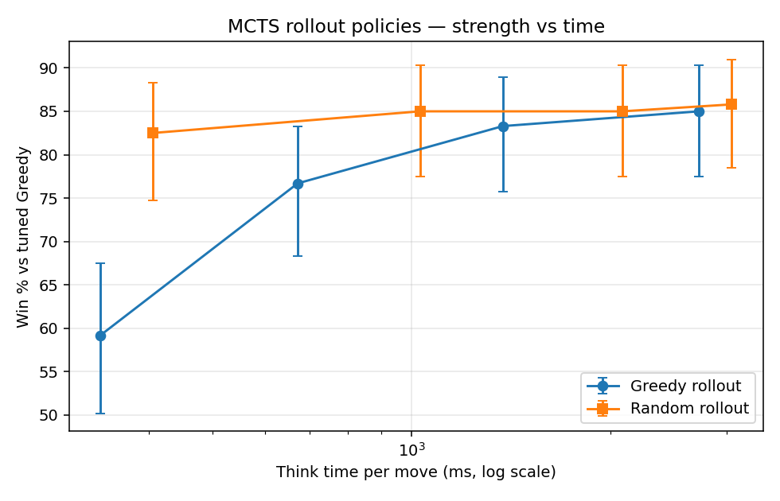

# Model Tuning — EXEC_MAGICA

How each agent's parameters are selected and frozen. Comparative rankings live in
[LADDER.md](LADDER.md); metric definitions in [METRICS.md](METRICS.md). Random is
untuned (the baseline).

## Method

- **Selection:** round-robin between candidate parameter sets.
- **Metric:** win rate with Wilson 95% CI; rank by the CI **lower bound**.
- **Discipline:** tune on **TRAIN** decks+seeds, confirm on **HELD-OUT** before freezing.
- **Budget:** Iterations (reproducible at seed) for all data; wall-clock only for live play.
- Common: alternating start, mirror matches, fixed seed set.

---

## Greedy (heuristic baseline)

**What.** A linear board-evaluation heuristic; tuning searches the relative weights of
its state-delta terms (hero HP fixed as the anchor).

**Search space**

| param | role | values |
|---|---|---|
| heroHpWeight | Δ hero HP (anchor) | fixed 1.0 |
| attackWeight | Δ Σ board attack | {1, 2, 3} |
| hpWeight | Δ Σ board HP | {0.5, 1} |
| minionCountWeight | Δ minion count | {0, 1, 2} |
| handCountWeight | Δ hand size | {0, 0.5, 1, 2, 4} |

**Setup.** Train: Aggro/Control. Holdout: Midrange/Token. 50 games/pair/deck.

**Selection**

*Train (top 3)*

| attack | hp | minionCount | handCount | win% | Wilson95 |
|---|---|---|---|---|---|
| 2 | 1 | 2 | 1 | 55.7 | 53.7–57.8 |
| 2 | 1 | 1 | 1 | 53.3 | 51.2–55.3 |
| 1 | 1 | 1 | 1 | 52.6 | 50.6–54.6 |

*Holdout (top 3)*

| attack | hp | minionCount | handCount | win% | Wilson95 | note |
|---|---|---|---|---|---|---|
| 2 | 1 | 1 | 1 | 54.5 | 51.5–57.4 | **chosen** |
| 2 | 1 | 2 | 1 | 51.7 | 48.8–54.7 | train leader, drops |
| 3 | 1 | 1 | 1 | 50.7 | 47.8–53.7 | attack=3 no better |

**Findings.** attack:hp ≈ 2:1 (attack=3 no gain, =1 worse); handCount peaks ~0.5–1;
minionCount=2 overfit train (−4 pts holdout), so minionCount=1 chosen for stability.

**Strength vs budget.** N/A — a fixed heuristic, no search budget.

> **Frozen:** `heroHp=1, attack=2, hp=1, minionCount=1, handCount=1`

---

## MCTS — rollout families

ISMCTS (determinized; knows opponent deck size, not contents). The **rollout policy** is
the leaf-evaluation strategy; each policy is its own family with its own tuning, and the
families are compared on a strength-vs-**time** basis (see [Comparison](#comparison--rollout-policies-strength-vs-time)).

*("Greedy rollout" uses the tuned Greedy heuristic above to play out leaves — it is not
the Greedy agent itself.)*

### MCTS · Greedy rollout

**What.** MCTS whose leaves are evaluated by a tuned-Greedy playout.

**Search space**

| param | role | values |
|---|---|---|
| rolloutPolicy | leaf evaluation | fixed **Greedy** (family) |
| explorationC | UCB exploration | {0.7, 1.41, 2.0} |
| maxRolloutActions | rollout depth cap | {20, 40} |
| finalSelection | root move pick | fixed MaxVisits |
| iterations | search budget | curve {100, 200, 400, 800} |

**Setup.** Opponent: tuned Greedy. Decks: Aggro/Control. Selection at fixed 400 iters,
60 games/candidate. Strength-vs-budget: 120 games/point, fatigue-on.

**Selection** *(C × mr, fixed 400 iters; pre-fatigue relative ranking)*

| explorationC | maxRolloutActions | win% vs Greedy | Wilson95 |
|---|---|---|---|
| **1.41** | **40** | **88.3** | 77.8–94.2 |
| 0.7 | 40 | 81.7 | 70.1–89.4 |
| 2.0 | 40 | 80.0 | 68.2–88.2 |
| any | 20 | 35–55 | — |

**Findings.**
- **maxRolloutActions=40 ≫ 20** (large effect): truncating ~50-action games yields garbage
  leaf values; rollouts must reach near-terminal.
- **explorationC=1.41** (√2) best; 0.7 / 2.0 slightly lower (within CI).

**Strength vs budget** *(fatigue-on, Aggro/Control)*

| iterations | win% vs Greedy | Wilson95 | mean think ms/move |
|---|---|---|---|
| 100 | 59.2 | 50.2–67.5 | 338  |
| 200 | 76.7 | 68.3–83.3 | 672  |
| 400 | 83.3 | 75.7–88.9 | 1374 |
| 800 | 85.0 | 77.5–90.3 | 2719 |

Saturates ~85% by 800 iters. **Think-time is deck-dependent:** 400 iters ≈ 1.4 s on
Aggro/Control but ≈ 2.2 s on the slower Midrange/Token holdout (81.4% [76.5–85.5], 2176 ms),
so the iteration budget that fits the ≤2 s ladder cap depends on the deck pool.

> **Frozen (search params):** `explorationC=1.41, maxRolloutActions=40, finalSelection=MaxVisits`

### MCTS · Random rollout

**What.** MCTS whose leaves are evaluated by a uniform-random playout — far cheaper per
iteration, so many more simulations fit the same time.

**Search space**

| param | role | values |
|---|---|---|
| rolloutPolicy | leaf evaluation | fixed **Random** (family) |
| explorationC | UCB exploration | fixed 1.41 (reused; rollout-robust) |
| maxRolloutActions | rollout depth cap | {40, 80, terminal} |
| finalSelection | root move pick | fixed MaxVisits |
| iterations | search budget | curve {1600, 3200, 6400, 12800} |

**Setup.** Opponent: tuned Greedy. Decks: Aggro/Control. 120 games/point. Fatigue-on.

**Selection** *(maxRolloutActions, judged on the time axis)*

| mr | iterations | win% vs Greedy | Wilson95 | mean think ms/move |
|---|---|---|---|---|
| 40 | 800 | 70.8 | 62.2–78.2 | 133 |
| 40 | 1600 | 82.5 | 74.7–88.3 | 267 |
| 80 | 800 | 74.2 | 65.7–81.2 | 168 |
| 80 | 1600 | 80.0 | 72.0–86.2 | 353 |
| terminal | 800 | 69.2 | 60.4–76.7 | 175 |
| terminal | 1600 | 73.3 | 64.8–80.4 | 350 |

**Findings.** mr=40 and mr=80 are statistically indistinguishable; running rollouts **to
terminal hurts** (lower win% *and* more time) — long random playouts add variance faster
than signal. Random rollout has a depth **sweet-spot ~40**, unlike greedy rollout (deeper
is better). → `maxRolloutActions = 40`.

**Strength vs budget** *(fatigue-on, Aggro/Control, mr=40)*

| iterations | win% vs Greedy | Wilson95 | mean think ms/move |
|---|---|---|---|
| 1600  | 82.5 | 74.7–88.3 | 405  |
| 3200  | 85.0 | 77.5–90.3 | 1029 |
| 6400  | 85.0 | 77.5–90.3 | 2083 |
| 12800 | 85.8 | 78.5–91.0 | 3050 |

Strong even at the lowest budget; saturates ~85%. Per-iteration cost ~0.25–0.33 ms —
**~14× cheaper** than greedy rollout.

> **Frozen (search params):** `explorationC=1.41, maxRolloutActions=40, finalSelection=MaxVisits`

### MCTS · ML rollout (value network)

**What.** *Future work (roadmap).* A learned value function replaces playout-based leaf
evaluation — aiming for high-quality leaf estimates at near-instant cost.

**Search space**

| param | role | values |
|---|---|---|
| rolloutPolicy | leaf evaluation | learned value network |
| network arch | value head | TBD |
| explorationC | UCB exploration | TBD (likely 1.41) |
| iterations | search budget | TBD |

> 🚧 Selection / Strength-vs-budget / Frozen to be added when the network ships.

---

## Comparison — rollout policies (strength vs time)

Greedy- vs random-rollout MCTS, both vs tuned Greedy, common decks (Aggro/Control),
fatigue-on. Win% is read against **mean think-time per move**, so the policies are
compared at matched compute — not at matched iterations.

| ~Time / move | Greedy rollout | Random rollout |
|---|---|---|
| ~340–405 ms | 59.2% | **82.5%** |
| ~670–1030 ms | 76.7% | **85.0%** |
| ~1370–2080 ms | 83.3% | 85.0% |
| ~2720–3050 ms | 85.0% | 85.8% |

**Finding.** At matched time, **random rollout dominates** — by ~23 pts at a tight ~400 ms
budget (CIs disjoint), the gap shrinking as the budget grows; both saturate at the ~85%
matchup ceiling. Random rollouts are ~14× cheaper per iteration, so under a time budget the
sheer **number** of simulations beats the higher per-rollout **quality** of greedy rollouts
— until both plateau.

---

## Frozen configs (summary)

Ladder agents run at the **strongest configuration whose mean think-time ≤ 2 s/move** on
the reference machine (the ladder eligibility cap — see [LADDER.md](LADDER.md)).

| Agent | Frozen parameters | Ladder budget | ≈ think/move | ≈ win% vs Greedy |
|---|---|---|---|---|
| **Greedy** | `attack=2, hp=1, minionCount=1, handCount=1` (heroHp anchor 1.0) | — | <1 ms | — |
| **MCTS · Greedy rollout** | `C=1.41, maxRolloutActions=40, finalSelection=MaxVisits` | **350 iters** | ~1.4 s | ~80% |
| **MCTS · Random rollout** | `C=1.41, maxRolloutActions=40, finalSelection=MaxVisits` | **3200 iters** | ~1.0 s | ~85% |

Under the ≤2 s cap, the **random-rollout** family reaches its ~85% plateau (3200 iters,
~1.0 s), while the **greedy-rollout** family cannot quite reach 85% (800 iters ≈ 2.7 s is
over budget) and competes at ~83% (400 iters). The practical time cap mildly favors the
cheaper rollout — consistent with the Comparison.

> Iteration budgets are deck-dependent in think-time; the final ladder run confirms each
> stays ≤2 s on its deck pool.