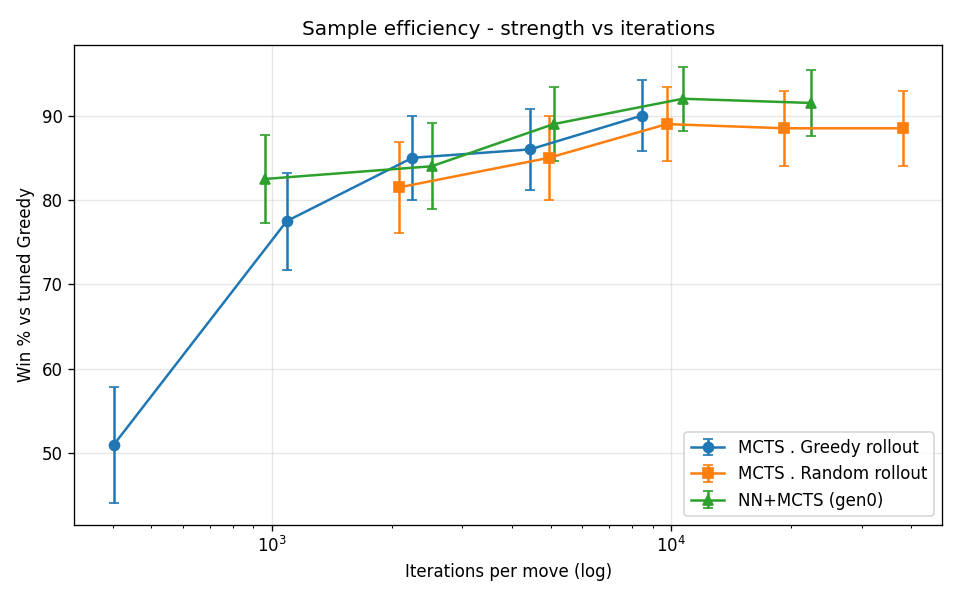

# Model Tuning — EXEC_MAGICA <!-- omit in toc -->

How each agent's parameters are selected and frozen. Comparative rankings live in
[LADDER.md](LADDER.md); metric definitions in [METRICS.md](METRICS.md). Random is
untuned (the baseline).

## Table of Contents <!-- omit in toc -->
- [Method](#method)
- [Greedy (heuristic baseline)](#greedy-heuristic-baseline)
- [MCTS — rollout families](#mcts--rollout-families)
  - [MCTS · Greedy rollout](#mcts--greedy-rollout)
  - [MCTS · Random rollout](#mcts--random-rollout)
  - [MCTS · Neural (NN-guided)](#mcts--neural-nn-guided)
- [Comparison — rollout families vs NN (strength vs time and iterations)](#comparison--rollout-families-vs-nn-strength-vs-time-and-iterations)
- [Frozen configs (summary)](#frozen-configs-summary)

## Method

- **Selection:** round-robin between candidate parameter sets.
- **Metric:** win rate with Wilson 95% CI; rank by the CI **lower bound**.
- **Discipline:** tune on **TRAIN** decks+seeds, confirm on **HELD-OUT** before freezing.
- **Budget:** parameter *sweeps* use fixed **iterations** (reproducible at seed); the **ladder** and head-to-heads use a **time budget** (1 s/move). iteration↔time is runtime/machine-dependent, so a
common wall-clock is the only cross-agent-fair footing (see the Frozen-configs note).

---

## Greedy (heuristic baseline)

**What.** A linear board-evaluation heuristic; tuning searches the relative weights of
its state-delta terms (hero HP fixed as the anchor).

**Search space**

| param | role | values |
|---|---|---|
| heroHpWeight | Δ hero HP (anchor) | fixed 1.0 |
| attackWeight | Δ Σ board attack | {1, 2, 3} |
| hpWeight | Δ Σ board HP | {0.5, 1} |
| minionCountWeight | Δ minion count | {0, 1, 2} |
| handCountWeight | Δ hand size | {0, 0.5, 1, 2, 4} |

**Setup.** Train: Aggro/Control. Holdout: Midrange/Token. 50 games/pair/deck.

**Selection**

*Train (top 3)*

| attack | hp | minionCount | handCount | win% | Wilson95 |
|---|---|---|---|---|---|
| 2 | 1 | 2 | 1 | 55.7 | 53.7–57.8 |
| 2 | 1 | 1 | 1 | 53.3 | 51.2–55.3 |
| 1 | 1 | 1 | 1 | 52.6 | 50.6–54.6 |

*Holdout (top 3)*

| attack | hp | minionCount | handCount | win% | Wilson95 | note |
|---|---|---|---|---|---|---|
| 2 | 1 | 1 | 1 | 54.5 | 51.5–57.4 | **chosen** |
| 2 | 1 | 2 | 1 | 51.7 | 48.8–54.7 | train leader, drops |
| 3 | 1 | 1 | 1 | 50.7 | 47.8–53.7 | attack=3 no better |

**Findings.** attack:hp ≈ 2:1 (attack=3 no gain, =1 worse); handCount peaks ~0.5–1;
minionCount=2 overfit train (−4 pts holdout), so minionCount=1 chosen for stability.

**Strength vs budget.** N/A — a fixed heuristic, no search budget.

> **Frozen:** `heroHp=1, attack=2, hp=1, minionCount=1, handCount=1`

---

## MCTS — rollout families

ISMCTS (determinized; knows opponent deck size, not contents). The **rollout policy** is
the leaf-evaluation strategy; each policy is its own family with its own tuning, and the
families are compared on a strength-vs-**time** basis (see [Comparison](#comparison--rollout-policies-strength-vs-time)).

*("Greedy rollout" uses the tuned Greedy heuristic above to play out leaves — it is not
the Greedy agent itself.)*

### MCTS · Greedy rollout

**What.** MCTS whose leaves are evaluated by a tuned-Greedy playout.

**Search space**

| param | role | values |
|---|---|---|
| rolloutPolicy | leaf evaluation | fixed **Greedy** (family) |
| explorationC | UCB exploration | {0.7, 1.41, 2.0} |
| maxRolloutActions | rollout depth cap | {20, 40} |
| finalSelection | root move pick | fixed MaxVisits |
| iterations | search budget | curve {100, 200, 400, 800} |

**Setup.** Opponent: tuned Greedy. Decks: Aggro/Control. Selection at fixed 400 iters,
60 games/candidate. Strength-vs-budget: 120 games/point, fatigue-on.

**Selection** *(C × mr, fixed 400 iters; pre-fatigue relative ranking)*

| explorationC | maxRolloutActions | win% vs Greedy | Wilson95 |
|---|---|---|---|
| **1.41** | **40** | **88.3** | 77.8–94.2 |
| 0.7 | 40 | 81.7 | 70.1–89.4 |
| 2.0 | 40 | 80.0 | 68.2–88.2 |
| any | 20 | 35–55 | — |

**Findings.**
- **maxRolloutActions=40 ≫ 20** (large effect): truncating ~50-action games yields garbage
  leaf values; rollouts must reach near-terminal.
- **explorationC=1.41** (√2) best; 0.7 / 2.0 slightly lower (within CI).

**Strength vs budget** *(fatigue-on, Aggro/Control)*

| iterations | win% vs Greedy | Wilson95 | mean think ms/move |
|---|---|---|---|
| 100 | 59.2 | 50.2–67.5 | 338  |
| 200 | 76.7 | 68.3–83.3 | 672  |
| 400 | 83.3 | 75.7–88.9 | 1374 |
| 800 | 85.0 | 77.5–90.3 | 2719 |

Saturates ~85% by 800 iters. **Think-time is deck-dependent:** 400 iters ≈ 1.4 s on
Aggro/Control but ≈ 2.2 s on the slower Midrange/Token holdout (81.4% [76.5–85.5], 2176 ms),
so the iteration budget that fits the ≤2 s ladder cap depends on the deck pool.

> **Frozen (search params):** `explorationC=1.41, maxRolloutActions=40, finalSelection=MaxVisits`

### MCTS · Random rollout

**What.** MCTS whose leaves are evaluated by a uniform-random playout — far cheaper per
iteration, so many more simulations fit the same time.

**Search space**

| param | role | values |
|---|---|---|
| rolloutPolicy | leaf evaluation | fixed **Random** (family) |
| explorationC | UCB exploration | fixed 1.41 (reused; rollout-robust) |
| maxRolloutActions | rollout depth cap | {40, 80, terminal} |
| finalSelection | root move pick | fixed MaxVisits |
| iterations | search budget | curve {1600, 3200, 6400, 12800} |

**Setup.** Opponent: tuned Greedy. Decks: Aggro/Control. 120 games/point. Fatigue-on.

**Selection** *(maxRolloutActions, judged on the time axis)*

| mr | iterations | win% vs Greedy | Wilson95 | mean think ms/move |
|---|---|---|---|---|
| 40 | 800 | 70.8 | 62.2–78.2 | 133 |
| 40 | 1600 | 82.5 | 74.7–88.3 | 267 |
| 80 | 800 | 74.2 | 65.7–81.2 | 168 |
| 80 | 1600 | 80.0 | 72.0–86.2 | 353 |
| terminal | 800 | 69.2 | 60.4–76.7 | 175 |
| terminal | 1600 | 73.3 | 64.8–80.4 | 350 |

**Findings.** mr=40 and mr=80 are statistically indistinguishable; running rollouts **to
terminal hurts** (lower win% *and* more time) — long random playouts add variance faster
than signal. Random rollout has a depth **sweet-spot ~40**, unlike greedy rollout (deeper
is better). → `maxRolloutActions = 40`.

**Strength vs budget** *(fatigue-on, Aggro/Control, mr=40)*

| iterations | win% vs Greedy | Wilson95 | mean think ms/move |
|---|---|---|---|
| 1600  | 82.5 | 74.7–88.3 | 405  |
| 3200  | 85.0 | 77.5–90.3 | 1029 |
| 6400  | 85.0 | 77.5–90.3 | 2083 |
| 12800 | 85.8 | 78.5–91.0 | 3050 |

Strong even at the lowest budget; saturates ~85%. Per-iteration cost ~0.25–0.33 ms —
**~14× cheaper** than greedy rollout.

> **Frozen (search params):** `explorationC=1.41, maxRolloutActions=40, finalSelection=MaxVisits`

### MCTS · Neural (NN-guided)

**What.** MCTS whose leaf evaluation is a learned **value head**, with a **policy-head prior**
in selection (PUCT) instead of a playout — see [AGENTS.md](AGENTS.md) → *MCTS · Neural*.

**Not grid-tuned here.** Unlike the Greedy / rollout families, this agent's quality is not a
small parameter search — the network is **trained** (distilled from self-play) and **evolves
by generation** (encoding, architecture, data). Its per-generation training config, metrics,
and strength live in **[GENERATIONS.md](GENERATIONS.md)**.

**Search-side params** (the few knobs that *are* config, not learned):

| param | role | value |
|---|---|---|
| networkResource | which trained weight set guides search | per generation |
| puctC | PUCT exploration / prior weight | 1.5 (initial) |
| explorationC | unused in NN mode (PUCT replaces UCB) | — |

> Selection / strength-vs-budget are tracked per generation in
> [GENERATIONS.md](GENERATIONS.md), not frozen here.

---

## Comparison — rollout families vs NN (strength vs time and iterations)

All three MCTS agents vs tuned Greedy, decks Aggro+Control (deck-averaged), 100 games/cell,
fatigue-on. Measured on the **.NET headless runner** (server GC) — see the runtime note below.

| think/move | Greedy rollout | Random rollout | NN+MCTS (gen0) |
|---|---|---|---|
| ~80 ms   | 51.0% | 81.5% | 82.5% |
| ~195 ms  | 77.5% | 85.0% | 84.0% |
| ~390 ms  | 85.0% | 89.0% | 89.0% |
| ~780 ms  | 86.0% | 88.5% | **92.0%** |
| ~1560 ms | 90.0% | 88.5% | **91.5%** |

Iterations to ~85% vs Greedy: **NN+MCTS ~2 700 · Greedy rollout ~2 250 · Random rollout ~4 950.**

**Findings (two axes).**
- **On time:** NN+MCTS matches or **edges** Random rollout (92% vs 88.5% at ~780 ms), and both ≫
  Greedy rollout at tight budgets (~80 ms: Greedy 51% — only ~400 iters fit).
- **On iterations:** NN+MCTS ≈ Greedy rollout ≫ Random rollout — NN reaches 85% with **~2× fewer
  iterations** than Random rollout; the learned prior roughly doubles per-iteration value.
- **Why NN wins as a class:** Greedy rollout has efficient but expensive iterations (slow on time);
  Random rollout has cheap but wasteful ones (~2×); **NN+MCTS = efficient *and* cheap-enough
  iterations**, competitive on *both* axes.

> **Runtime note.** iteration↔time depends on the runtime. These are **.NET-runner** figures
> (Random rollout ~19 000 it/s vs ~3 200 on Unity/Mono). Cross-agent fairness comes from the
> **time budget**, not iteration counts — the earlier Unity iteration budgets are superseded.

---

## Frozen configs (summary)

Every search agent is compared at a **common time budget of 1 s/move** (`Budget.Time`); iterations are
an *output*, not a frozen input. Figures below are from the final time-matched ladder
([LADDER.md](LADDER.md)); mean think/move ≈ 0.78 s (forced 1-move states,
counted at 0 ms, pull the average below the 1 s cap).

| Agent | Frozen parameters | iters/move @ 1 s | Elo |
|---|---|---|---|
| **random** | — | — | 0 (anchor) |
| **Greedy** | `attack=2, hp=1, minionCount=1, handCount=1` (heroHp anchor 1.0) | — | 492 |
| **MCTS · Greedy rollout** | `C=1.41, maxRolloutActions=40, finalSelection=MaxVisits` | ~2 400 | 722 |
| **MCTS · Random rollout** | `C=1.41, maxRolloutActions=40, finalSelection=MaxVisits` | ~14 700 | 741 |
| **MCTS + NN (gen0)** | `net h128 v2 · mix=0.75 · mr=40 · C=1.41 · PuctC=1.5` | ~8 500 | 794 |
| **MCTS + NN (gen1)** | `net h128 v2 · mix=0.75` (temp=1.3 self-play champion) | ~9 100 | 856 |
| **MCTS + NN (gen2)** | `net h128 v3-1616 · mix=0.75` (unseen-card pools) | ~7 100 | 860 |
| **MCTS + NN (gen3)** | `net h128 v3-1616 · mix=0.75` (pool-aware teacher) | ~8 500 | 877 |

> **Why time, not frozen iterations.** An earlier ladder froze each agent at a hand-tuned iteration count
> chosen to hit ~1 s/move — but that is **machine-dependent**: the same count yields very different
> wall-clock on different hardware (and after the deep-copy speed-up), so the denser v3 nets silently got
> more time and an **inflated Elo**. A `Budget.Time` ladder removes the calibration entirely and rates every
> agent on the same footing. Note the iters/move column: the NN agents do **fewer** iterations than plain
> Random rollout (~14 700) yet rank far higher — the learned prior + value make each iteration count.
> (PuctC is still at its initial **1.5**, never grid-searched — a free tuning lever for future work.)
